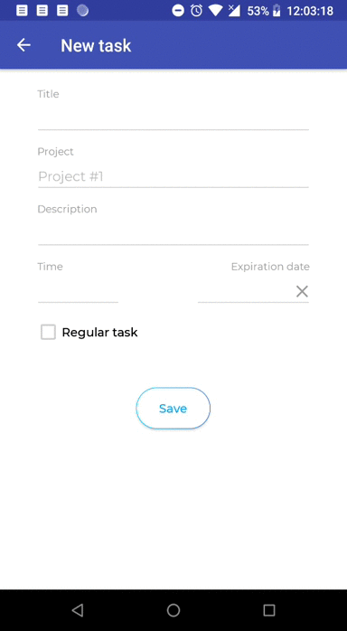

# Bindible Task Fragment
It's a one screen from the app main idea of which is a time tracking, creating a schedule and statistics displaying.

Fragment with data saving/loading from the _Room Database_ and presenting with _Two-way data binding_:  

